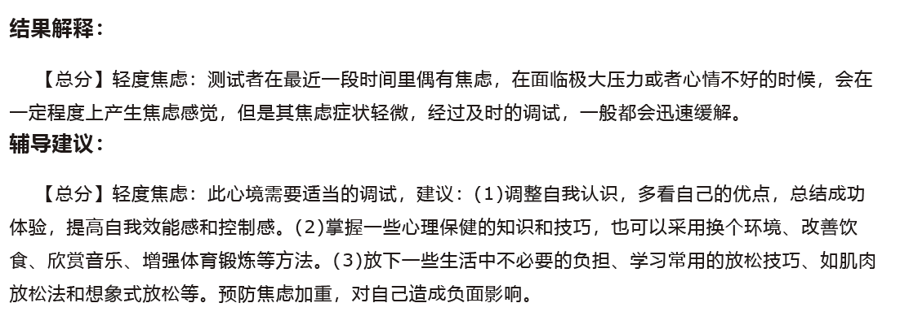

# 烦人的自己

## 2020年9月22日

最近有些焦虑

这并不是凭空而论，而是真正地通过学校提供的心理测试量表得出的结论

这样的结果出乎我的意料，或者说你的意料。扪心自问，一个能够迅速掌握gitbook的人，并准备有计划地学习markdown语言的人，怎么会焦虑？

也许“焦虑”一词描述的是，一种状态，人与人的焦虑状态都有所不同。其实心理测试是昨天测的，而今天之所以写这篇日记，就是发现了对我自己的焦虑状态的一种描述，一个让别人能很快理解的例子。

### 例子——“焦虑”

今天早上继续了昨天迎接新生的工作，包括给他们找PC的配件和调试PC，我的鼠标库存已经没有，新学了破解win10密码的发方法，这些还不够烦人，烦人的是突然有人要求我收拾（选择性地扔掉）已经毕业的师姐留下的东西，要知道虽然她是我师姐，但是物理意义上我们并不在同一间实验室，而同实验室的女生们却无动于衷（忙于秋招），就是这样，我收获了我的第一份&lt;焦虑&gt;。我想着重强调，带&lt;&gt;尖括号的字样总是会伴随前文所说的一种描述，一个让别人能很快理解的例子。继续回到我收获的&lt;焦虑&gt;。

（别急，就在下面）

对于大大小小的物品，我迅速地做出了选择，保留了未开封的护肤品、未开封的水果削皮刀、一听雪碧。哦，我当时怎么也想不到，这一听雪碧是今天最大的收获。我安顿好新生们的PC，又和一位新生一起见了导师。终于回到了座位上，我拿起那一罐细长的圆柱体，闹钟赫然闪过一张图，雷碧（为什么会是雷碧？），雪碧虽然不健康，但它是一个大众品牌，是值得信赖的，而雷碧是一种假冒伪劣的产品，看起来就是那种为了厂家的利益不择手段的商品，**我是如此地担心自己的生活中突如起来的变故，以至于一件似乎不明来历的可靠商品，在脑海中幻化出其对应的假冒伪劣的形象**。真物与伪物之辩有空再谈。

